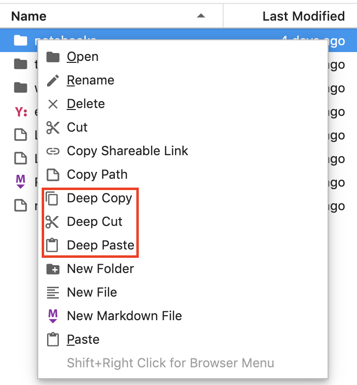

# Tubi JupyterLab Extensions

[](https://travis-ci.org/Tubitv/jupyterlab-extensions)
[](https://opensource.org/licenses/BSD-3-Clause)
[](https://lerna.js.org/)

## JupyterLab Extensions

|#|extension|package name|
|---|---|---|
|1|[nteract-data-explorer](packages/nteract-data-explorer/README.md)|@tubitv/nteract-data-explorer|
|2|[filebrowser-share-file](packages/filebrowser-share-file/README.md)|@tubitv/filebrowser-share-file|
|3|[filebrowser-deep-copy-paste](packages/filebrowser-deep-copy-paste/README.md)|@tubitv/filebrowser-deep-copy-paste|

### nteract Data Explorer
JupyterLab wrapper of [nteract Data Explorer](https://github.com/nteract/data-explorer) from Netflix. Unlike [JupyterLab Data Explorer](https://github.com/jupyterlab/jupyterlab-data-explorer), the extension renders table and charts within the same cell as code, and doesn't require a separate tab. Also the extension solved one drawback&mdash;state saving&mdash;in [nteract Data Explorer](https://blog.nteract.io/designing-the-nteract-data-explorer-f4476d53f897).  

### Shareable Links
The default "Copy Shareable Link" doesn't actually generate shareable links, because the link is either local or with our owner username (in JupyterHub) in it. The route [`/user-redirect/`](https://jupyterhub.readthedocs.io/en/stable/reference/urls.html#user-redirect) in JupyterHub solves the issue. Being a [standalone plugin](https://github.com/jupyterlab/jupyterlab/issues/5388) in JupyterLab, we integrated the route in the extension. Before install this extension, please remember to [disable](https://jupyterlab.readthedocs.io/en/stable/developer/extension_points.html#copy-shareable-link) the default one.

### Copy & Paste Directories
The "Copy" and "Paste" menu items can't operate on each files and directories in a folder recursively, so the extension is created for the purpose.  

Extensions of shareable links and copy/paste directories are as follows:



The following demo shows how these extensions are used in a local JupyterLab, but doesn't show the power of shareable links (better used in JupyterHub).


## Prerequisites

- Python >=3.7

`conda` is the preferred Python virtual environment manager in the repo. For `conda` installation, please refer to [Miniconda](https://docs.conda.io/en/latest/miniconda.html).
- Node.js >=10

Download and install Node.js in this [page](https://nodejs.org/en/download/) in which process `npx` and `npm` are installed as well.

## Installation

### All-in-one installation

```bash
./scripts/install.sh
```

### Step-by-step installation

#### Install Python

```bash
conda create -n jupyterlab-ext python=3.7 -y
conda activate jupyterlab-ext
pip install -r requirements.txt
```

[requirements.txt](./scripts/requirements.txt) contains these PyPI packages
- jupyterlab==1.1.1
- pandas
- dx

#### Install extensions

We use [Lerna](https://github.com/lerna/lerna) to manage all JupyterLab extensions.

```bash
# Install npm package dependencies
npx lerna bootstrap

# Compile all packages
npx lerna run build

# Disable JupyterLab share-file
jupyter labextension disable @jupyterlab/filebrowser-extension:share-file

# Install extensions
jupyter labextension install packages/filebrowser-share-file
jupyter labextension install packages/filebrowser-deep-copy-paste
jupyter labextension install packages/nteract-data-explorer

# List installed extensions
jupyter labextension list
```

## Run
```bash
jupyter lab
```
Please check notebooks in the [examples](./examples).

## Development
Please check `README.md` of each package.
